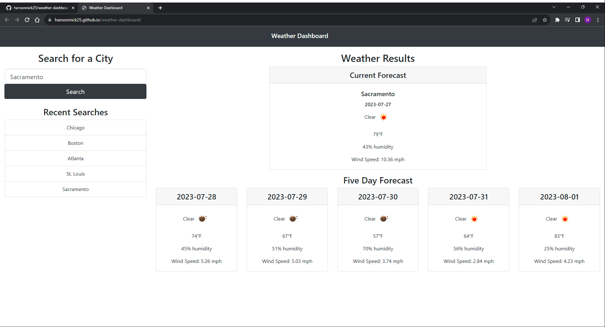

# Weather Dashboard

Weather Dashboard is a simple web interface to look up current weather and 5 day forecasts of a city you submit

## Description

Weather Dashboard utilizes jQuery to fetch weather data from [openweathermap.com](https://openweathermap.org/api) and then displays that data in cards created in Bootstrap

## Technologies

Work Day Schedule uses the following libraries:

- BootStrap
- JQuery

## Contributing

README template borrowed from [Make a README](https://www.makeareadme.com/)

## License

[MIT](https://choosealicense.com/licenses/mit/)

## Screenshots

